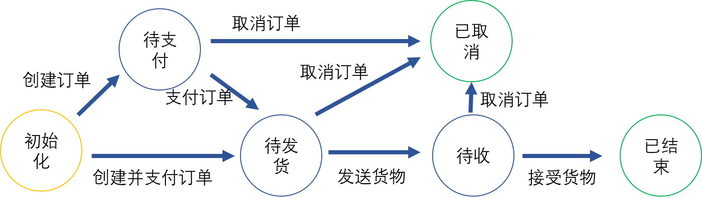
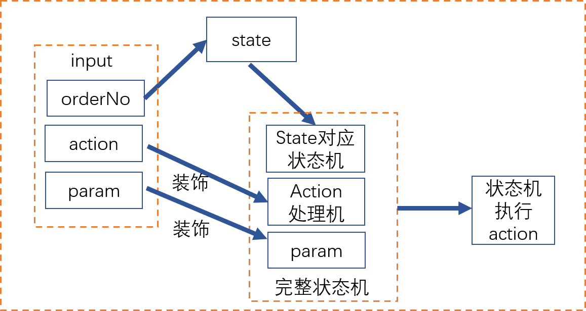
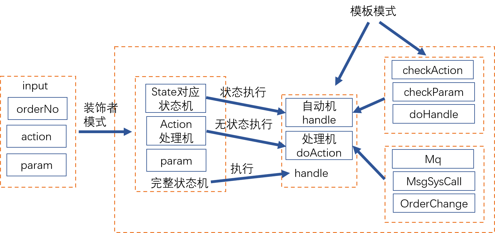
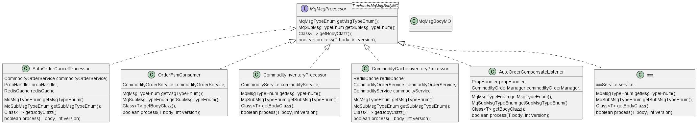

# 订单系统

做了好久，好累啊，每天看日志，改bug，重新设计，gggg。

- [x] 高并发
- [x] 幂等性
- [x] 一致性
- [x] 限流保护
- [x] RPC服务
- [ ] 注册中心
- [ ] 动态限流
- [ ] 高可用
- [ ] 可扩展
- [ ] LSM-Tree 作为库存系统持久化。
- [x] 库存内存队列
- [x] 消息队列高可用


## 简介

此项目是一个简单的订单系统（学习项目），包含库存模块、订单模块、支付模块等3个模块。

**功能性需求**：

1. 用户可以对商品下订单。
2. 商品不允许超量下订单。
3. 用户可以对商品执行支付。
4. 用户可以在完成终态前任何一个状态取消订单。
5. 订单超时未支付，自动取消。
6. 商家可以发送商品。
7. 用户可以签收商品。
8. 用户可以查询商品。

**非功能性需求**：

1. 幂等性保证
2. 可用性
3. 高并发
4. 可扩展
5. 流量控制

**希望达到目标**：

1. 对订单业务理解更深入。
2. 学习Mysql，redis，Kafka，rabbitMq的使用。
3. 对多服务调用，并发场景，多线程情况有所了解。


### 订单系统流程介绍

整个订单系统，可以理解为多个状态的转移过程，一个订单的状态可以有，初始化状态，待支付状态，待服务状态，待接收接受状态等等，但是使用需要达到一个终态，在此系统中终态可以理解为已完成、已取消状态。而订单之间的状态转移需要通过动作来执行，所以相应动作会造成一系列的事件，其中包含核心状态转移，以及后续触发状态转移（用户通知，下游积分逻辑等等）。




### 订单系统架构

基于以上的流程，我们可以将整个订单系统抽象为订单由action触发的订单转移过程，也是订单系统的核心过程。对于此过程，可以进一步抽象出不同state下，对应的action执行造成的影响过程，所以订单系统架构将由前面所述展开，使用有限状态自动机完成相关订单转移过程。首先根据前述功能性需求，可以提供多个服务，其中对应着以上的action部分，所以系统的服务部分针对用户action进行。而对于action的状态，则需要通过订单目前的状态进行查询。



对于state，如果action是init，会直接指定initstate，其他的情况都是直接通过orderNo获取相应的state，然后再从action的map中寻找相应的状态机。**而在订单action执行过程中，涉及到库存部分以及支付部分**，遵循单一功能原则，将库存模块与支付模块分开。整个订单系统分为订单模块，库存系统，支付系统三个部分。

### 整体架构



### 难点

功能性难点实现

1. 库存的超卖问题。
1. 库存，订单，支付系统一致性问题。
1. 订单补偿问题。
1. 整个订单系统架构设计。
1. 组件系统的架构设计。

非功能性难点

1. 消息队列的可用性。
2. 订单系统的整体幂等性。
3. 缓存的库存和数据库的库存的一致性。
4. 订单缓存和数据库一致性问题。

### 亮点

**订单模块整体架构设计**

要想完成订单系统的整体架构设计，需要首先对订单系统业务理解，在是对事物抽象的能力。

按照1.2图中所述，整个订单系统的责任模式，都可以抽象为那个流程。

而编码上，并不是所有的流程都需要额外的param，而且同一个状态可以面对多个action（待支付，面对pay和cancel的action）。所以此处类似于一个流水车间，采用**装饰器模式**，一个完整可用的状态机由状态机+action+param构成。

而对于action造成的影响，可以抽象为2个过程，首先是状态机相关action的执行状态直接转移过程（核心流程），再者是action执行后下游的逻辑链路（非核心流程，通知用户，通知商户，下游积分逻辑等）。此处使用**模板模式**，将有状态的状态机的处理与无状态的action成功后的下游逻辑执行。



**消息队列可用性**

想法是使用策略模式将消息队列的消费都集中起来，这里在加载如不同的消息队列，做到消息队列无关。

例如消息队列R(Rabbit)+K(Kafka).

我设计的部分Mq的消息总是从偶数开始，不知道对负载均是否影响。

伪代码

```java
int type=MQ_MSG_TYPE%2
boolean result=false;
if (type==0){
	boolean success=R.sendMsgTask(task);
	if(!success){
		success=K.sendMsgTask(task);
	}
	result=result||success;
}else if(type==1){
	boolean success=K.sendMsgTask(task);
	if(!success){
		success=R.sendMsgTask(task)
	}
	result=result||success;
}
```


**消息队列的架构**

Mq的消费者行为，目前我看来可以分解为单词消费与批量消费过程，而对于单次消费过程又可以理解为process消息。所以消费队列的单次消费过程，完全可以由策略模式封装。

```java
public interface MqMsgProcessor<T extends MqMsgBodyMO> {
    MqMsgTypeEnum getMsgTypeEnum();
    MqSubMsgTypeEnum getSubMsgTypeEnum();
    Class<T> getBodyClazz();
    boolean process(T body, int version);
}
```


MsgType+SubMsgType确认唯一的MqMsgProcessor。而对于版本支持，则是从process层面去实现的。

```java
public class MqMsgMO {
    private Integer msgType;
    private String msgId;
    private Integer version;
    private Integer subMsgType;
    private String subMsgId;
    private Integer subVersion;
    protected String body;
...
```

设置SubMsgType是为了方便下游消息管理，例如一个创建订单操作，可以会触发多个下游mq，这些mq使用相同的MsgType，各自有各自的SubMsgType在发送消息的时候，只需要知道MsgType就能给所有的子消息发送消息了。



### 代码

目前已经完成了第一个版本迭代，下一个版本迭代希望从基础功能到高并发场景，库存锁粒度细分，库存token化，优惠卷系统接入，完成模块细分微服务化。

核心代码demo在code文件夹内，当项目完成下一个版本迭代将会完全开源。
