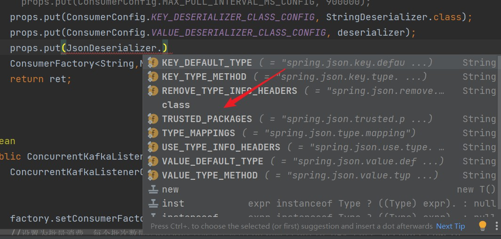

# 消息队列

目前只支持rabbitmq，但是rabbitmq的消费速度还是堪忧，所以除了延迟队列，其他的就换个消息队列吧，比如Kafka，yyds。


## 安装

[docker安装Kafka](https://github.com/conduktor/kafka-stack-docker-compose)

其实这一步花费了一点时间，因为我的docker在服务器上，而我不知道他这个是本地的部署，花了一点时间翻阅StackOverflow和GitHub issue才安装成功。

```dockerfile
 kafka1:
    image: confluentinc/cp-kafka:7.3.2
    hostname: kafka1
    container_name: kafka1
    ports:
      - "9092:9092"
      - "29092:29092"
    environment:
      KAFKA_ADVERTISED_LISTENERS: INTERNAL://kafka1:19092,EXTERNAL://${DOCKER_HOST_IP:-127.0.0.1}:9092,DOCKER://host.docker.internal:29092
      KAFKA_LISTENER_SECURITY_PROTOCOL_MAP: INTERNAL:PLAINTEXT,EXTERNAL:PLAINTEXT,DOCKER:PLAINTEXT
      KAFKA_INTER_BROKER_LISTENER_NAME: INTERNAL
      KAFKA_ZOOKEEPER_CONNECT: "zoo1:2181"
      KAFKA_BROKER_ID: 1
      KAFKA_LOG4J_LOGGERS: "kafka.controller=INFO,kafka.producer.async.DefaultEventHandler=INFO,state.change.logger=INFO"
      KAFKA_AUTHORIZER_CLASS_NAME: kafka.security.authorizer.AclAuthorizer
      KAFKA_ALLOW_EVERYONE_IF_NO_ACL_FOUND: "true"
    depends_on:
      - zoo1
```

问题出现在这一行。

```dockerfile
INTERNAL://kafka1:19092,EXTERNAL://${DOCKER_HOST_IP:-127.0.0.1}:9092,DOCKER://host.docker.internal:29092
```

我以为他这个意思是在服务器暴露找本机的地址。但是阅读一些博客后发现internal指的本机，而external指的对外地址，如果对外地址是本机，那么返回到我这里，就是我自己电脑本地。如果在本地docker上，这个是合乎逻辑的，但是如果布置在服务器上，用服务器ip就可以了。

`docker-compose`建议使用pip安装。

其他的问题并不大。到这里集群应该是成功了。

不放心可以进入容器运行下,先创建一个test主题。

消费者监听

```
kafka-console-consumer --bootstrap-server localhost:9092 --topic test
```

生产者生产

```
kafka-console-producer --broker-list localhost:9092 --topic test
```

出问题，先看docker-compose有没有问题，再看Kafka的日志。


## 代码

代码其实Kafka得配置还是会对相关消费者代码编写产生很大的影响。

相关代码配置开源，之后会放出来的，配置过程还是挺折磨人得，看文档StackOverflow看麻了。

```yml
 kafka:
    bootstrap-servers: 42.193.170.22:9092,42.193.170.22:9093,42.193.170.22:9094 # kafka集群信息，多个用逗号间隔
    # 生产者
    producer:
      # 重试次数，设置大于0的值，则客户端会将发送失败的记录重新发送
      retries: 3
      batch-size: 16384 #批量处理大小，16K
      buffer-memory: 33554432 #缓冲存储大，32M
      acks: -1
      linger: 100
      # 指定消息key和消息体的编解码方式
      #        key-serializer: org.apache.kafka.common.serialization.StringSerializer
      #        value-serializer: org.apache.kafka.common.serialization.StringSerializer
      # 消费者
    consumer:
      # 消费者组
      group-id: TestGroup
      properties:
        spring:
          json:
            trusted:
              packages: "*"
      # 是否自动提交
      enable-auto-commit: false
      max-poll-records: 20

      # 消费偏移配置
      # none：如果没有为消费者找到先前的offset的值,即没有自动维护偏移量,也没有手动维护偏移量,则抛出异常
      # earliest：在各分区下有提交的offset时：从offset处开始消费；在各分区下无提交的offset时：从头开始消费
      # latest：在各分区下有提交的offset时：从offset处开始消费；在各分区下无提交的offset时：从最新的数据开始消费
      auto-offset-reset: earliest
      #        key-deserializer: org.apache.kafka.common.serialization.StringDeserializer
      #        value-deserializer: org.apache.kafka.common.serialization.StringDeserializer
      # 监听
    listener:
      ack-mode: manual_immediate
```


这个配置文件，其实并不是全部起作用，因为我自己很多直接内部设置了，同时为了兼容之前的rabbitmq，整个代码逻辑做了很多封装。

文件结构

+ kafka
+ - KafkaClient
  - KafkaConfig
  - KafkaConstantant
  - KafkaConsumerListener
  - KafkaTopics


```java
@Configuration
@EnableKafka
public class KafkaConfig {

    @Value("${spring.kafka.bootstrap-servers}")
    private String bootstrapServers;

    @Value("${spring.kafka.consumer.group-id}")
    private String groupId;

    @Value("${spring.kafka.consumer.enable-auto-commit}")
    private Boolean autoCommit;

    @Value("${spring.kafka.consumer.auto-offset-reset}")
    private String autoOffsetReset;
    //
    @Value("${spring.kafka.consumer.max-poll-records}")
    private Integer maxPollRecords;
    //
    @Value("${spring.kafka.producer.linger}")
    private int linger;

    @Value("${spring.kafka.producer.retries}")
    private Integer retries;

    @Value("${spring.kafka.producer.batch-size}")
    private Integer batchSize;

    @Value("${spring.kafka.producer.buffer-memory}")
    private Integer bufferMemory;

    @Value("$(spring.kafka.consumer.properties.spring.json.trusted.packages)")
    private String trust;

    //cankao :https://blog.csdn.net/tmeng521/article/details/90901925
    public Map<String, Object> producerConfigs() {

        Map<String, Object> props = new HashMap<>();
        props.put(ProducerConfig.BOOTSTRAP_SERVERS_CONFIG, bootstrapServers);
        //设置重试次数
        props.put(ProducerConfig.RETRIES_CONFIG, retries);
        //达到batchSize大小的时候会发送消息
        props.put(ProducerConfig.BATCH_SIZE_CONFIG, batchSize);
        //延时时间，延时时间到达之后计算批量发送的大小没达到也发送消息
        props.put(ProducerConfig.LINGER_MS_CONFIG, linger);
        //缓冲区的值
        props.put(ProducerConfig.BUFFER_MEMORY_CONFIG, bufferMemory);
        //序列化手段
        props.put(ProducerConfig.KEY_SERIALIZER_CLASS_CONFIG, StringSerializer.class);
        props.put(ProducerConfig.VALUE_SERIALIZER_CLASS_CONFIG, JsonSerializer.class);
        //producer端的消息确认机制,-1和all都表示消息不仅要写入本地的leader中还要写入对应的副本中
        props.put(ProducerConfig.ACKS_CONFIG, "-1");//单个brok 推荐使用'1'
        //单条消息的最大值以字节为单位,默认值为1048576
//        props.put(ProducerConfig.LINGER_MS_CONFIG, 10000);
        //设置broker响应时间，如果broker在60秒之内还是没有返回给producer确认消息，则认为发送失败
        props.put(ProducerConfig.REQUEST_TIMEOUT_MS_CONFIG, 60000);
        //指定拦截器(value为对应的class)
        //props.put(ProducerConfig.INTERCEPTOR_CLASSES_CONFIG, "com.te.handler.KafkaProducerInterceptor");
        //设置压缩算法(默认是木有压缩算法的)
        props.put(ProducerConfig.COMPRESSION_TYPE_CONFIG, "snappy");//snappy
        return props;
    }


    @Bean //创建一个kafka管理类，相当于rabbitMQ的管理类rabbitAdmin,没有此bean无法自定义的使用adminClient创建topic
    public KafkaAdmin kafkaAdmin() {
        Map<String, Object> props = new HashMap<>();
        //配置Kafka实例的连接地址
        //kafka的地址，不是zookeeper
        props.put(AdminClientConfig.BOOTSTRAP_SERVERS_CONFIG, bootstrapServers);
        KafkaAdmin admin = new KafkaAdmin(props);
        return admin;
    }

//    @Bean  //kafka客户端，在spring中创建这个bean之后可以注入并且创建topic,用于集群环境，创建对个副本
//    public AdminClient adminClient() {
//        return AdminClient.create(kafkaAdmin().getConfig());
//    }


    @Bean
    public ProducerFactory<String, MqMsgMO> producerFactory() {
        return new DefaultKafkaProducerFactory<>(producerConfigs());
    }

    @Bean("KafkaTemplate")
    public KafkaTemplate<String, MqMsgMO> KafkaTemplate() {
        return new KafkaTemplate<String, MqMsgMO>(producerFactory());
    }


    @Bean
    public ConsumerFactory<String, MqMsgMO> consumerConfigs() {
        JsonDeserializer<MqMsgMO> deserializer = new JsonDeserializer<>(MqMsgMO.class);
        deserializer.setRemoveTypeHeaders(false);
        deserializer.addTrustedPackages("*");
        deserializer.setUseTypeMapperForKey(true);

        Map<String, Object> props = Maps.newHashMap();
        props.put(ConsumerConfig.GROUP_ID_CONFIG, groupId);

        props.put(ConsumerConfig.ENABLE_AUTO_COMMIT_CONFIG, autoCommit);
//        props.put(ConsumerConfig.ENABLE_AUTO_COMMIT_CONFIG)
        props.put(ConsumerConfig.AUTO_OFFSET_RESET_CONFIG, autoOffsetReset);
        props.put(ConsumerConfig.BOOTSTRAP_SERVERS_CONFIG, bootstrapServers);
        props.put(ConsumerConfig.MAX_POLL_RECORDS_CONFIG, maxPollRecords);
//        props.put(ConsumerConfig.SESSION_TIMEOUT_MS_CONFIG, 180000);
        props.put(ConsumerConfig.REQUEST_TIMEOUT_MS_CONFIG, 90000);
//        props.put(ConsumerConfig)
//        props.put(ConsumerConfig.MAX_POLL_INTERVAL_MS_CONFIG, 900000);
        props.put(ConsumerConfig.KEY_DESERIALIZER_CLASS_CONFIG, StringDeserializer.class);
        props.put(ConsumerConfig.VALUE_DESERIALIZER_CLASS_CONFIG, deserializer);
        ConsumerFactory<String,MqMsgMO> ret=new DefaultKafkaConsumerFactory<>(props, new StringDeserializer(), deserializer);
        return ret;
    }


    @Bean
    public ConcurrentKafkaListenerContainerFactory<String,MqMsgMO> kafkaListenerContainerFactory() {
        ConcurrentKafkaListenerContainerFactory<String, MqMsgMO> factory = new ConcurrentKafkaListenerContainerFactory<>();


        factory.setConsumerFactory(consumerConfigs());
        //设置为批量消费，每个批次数量在Kafka配置参数中设置ConsumerConfig.MAX_POLL_RECORDS_CONFIG
        factory.setBatchListener(false);
        // set the retry template
//        factory.setRetryTemplate(retryTemplate());
        factory.getContainerProperties().setAckMode(ContainerProperties.AckMode.MANUAL);
        return factory;
    }
//    @Bean
//    public KafkaListenerContainerFactory<?> multipleKafka(){
//
//    }


}
```


### 生产者部分

核心文件那必须是KafkaConfig。其实生产者配置并不复杂，逻辑很简单，相关的什么配置想要什么效果可以去看官方文档和其他大佬总结的，我这里才入手，直接使用了推荐配置。

`bug 1`生产者配置遇到了一个bug，我为了兼容rabbitmq的架构设计，所以使用传递消息体是一个固定结构MqMsgMO，就一个对象，包含对象和创建时间msgid，消息类型等信息。我看对象修饰需要用JsonSerializer，我当时直接把key和value都设置成了这个。所以当测试Kafka的时候，测试很多次，它可以发送出去，但是无法被服务器接受，后来尿尿的时候想到了这个key应该不能设置为JsonSerializer（厕所真是思考好去处）。后来设置完这个，服务器接受消息成功。


### 消费者部分

消费者各个关系也是很重要,消费者首先是监听接口

```java
 @KafkaListener(topics = {KafkaConstant.KA_TOPIC_2}, groupId = "group1", containerFactory = "kafkaListenerContainerFactory")
    public void consumerMessage(ConsumerRecord<String, MqMsgMO> record, final Acknowledgment ack) {
//        logger.info("msg come!");
        process(record, false, ack);
    }
```

这里的主题,需要先注册到bean容器中,我这里由于想本地方便点,就直接使用Java的类储存设置了,免得每次都初始化.这里消费者需要设置主题,然后是消费者组,然后是消费的容器工厂`containerFactory`,就是config里面的设置,bean的注入方式应该是按照名字在这个地方.这里就是给消费者设置各种东西的地方.这个可以有很多个,比如你想要批量拉取,还想自动ack,在写一个在上面config文件里类似的配置类,加入ioc容器在调用即可.这里的设计还是很巧妙的,将整个拉去逻辑交给用户,但可以匹配多个topic.


消费者也是一堆设置，这个地方遇到一堆破bug。首先是对象解析，网上给出了一堆解答都是直接改配置文件，我的配置过程是手动的，这个肯定不起效果，问题是在哪里配置这个，后来在StackOverflow上找到了2个解决方案。

1. 如上面ConsumerFactory设置，先设置装载的map，然后将工程加入序列化和反序列化的代码。
2. 他个骚东西，可以直接给反序列化类进行设置，如下图演示下。

```yml
 properties:
        spring:
          json:
            trusted:
              packages: "*"
```



`bug2`消费者消费的消息数目不对劲。

这个起源于我设置了批量拉去，但是我的消息接受用的@Payload,消费的时候失败了直接返回了false，然后先本地尝试几次，然后返回nack，但是总是发的消息次数少了。如果批量拉去，nack()不带index是有问题的，所以直接设置为不批量拉取了.(我这里设置了手动ack模式,才有ack这个参数,看自己的设置,这个不一定有)

```java
 @KafkaListener(topics = {KafkaConstant.KA_TOPIC_1}, groupId = "group1", containerFactory = "kafkaListenerContainerFactory")
    public void consumerMessageTopic1(@Payload MqMsgMO record, final Acknowledgment ack) {
        logger.info("msg come!");
//        re.getId();
        process(record, false, ack);
    }
```

批量拉取和参数要对应,如果开启了批量拉去,要用List<ConsumerRecord<>>,匹配消费,如果单条消息消费失败了,直接用record.offset()定位(还没用过应该可以把). 如果没有开启批量,就直接ConsumerRecord<>就可以了.


## 总结

东西很厉害,还在调试了,希望能找到一款好用的可视化工具来监听消息.rabbitmq的manager就很好用.后续多消息拉去,很多线程在慢慢+l;.
